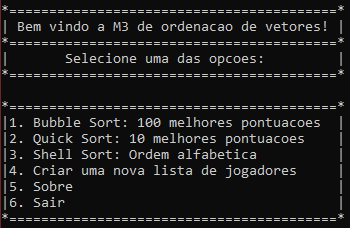

# sorting_algorithms

Application that shows 3 differents methods of sorting algorithms in C++.
Every time that you press enter, it generates a new list of players.


# Technologies

* Bubble sort
* Quick sort
* Shell sort

# Requirements

* C++ IDE

# Output example


# 1. 100 highest pontuations with BubbleSort
```
 01. qj [       999     ]
 02. lv [       976     ]
 03. dd [       973     ]
 04. hi [       968     ]
 05. bi [       953     ]
 ...100
```

# 2. 10 highest pontuations with QuickSort
```
 01. qj  [      999     ]
 02. lv  [      976     ]
 03. dd  [      973     ]
 04. hi  [      968     ]
 05. bi  [      953     ]
 06. nq  [      937     ]
 07. dt  [      922     ]
 08. nt  [      921     ]
 09. nv  [      915     ]
 10. hy  [      914     ]
```

# 3. Alphabetical order with ShellSort
```
 01. am  [      999     ]
 02. am  [      976     ]
 03. an  [      973     ]
 04. as  [      968     ]
 05. bi  [      953     ]
```
